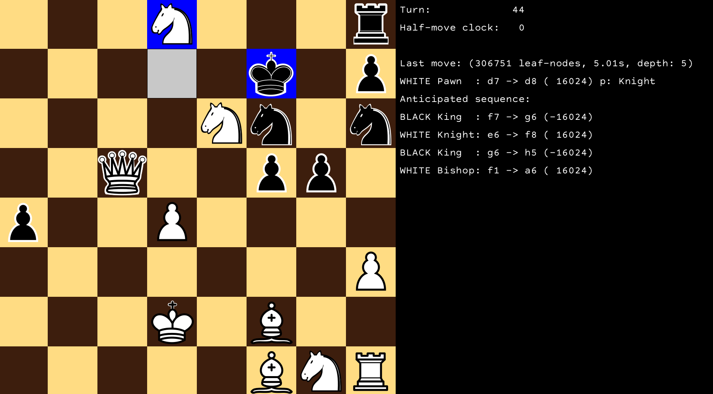

# ChessBot
### A Chess playing program based on negamax 

The negamax algorithm is a variant of minimax, which takes into account the zero-sum nature of Chess: 
however good a move is for you, that's how bad it is for your opponent and vice versa. 
Furthermore, at each point in the game however much you are winning by, 
that's how much your opponent is losing by. You can find a brief description below, 
or more [here](https://en.wikipedia.org/wiki/Negamax).

The bot constructs a tree, where the nodes are states of the board, 
joined by a legal move. The 'value' of a player's move to a player is equivalent to how 
'bad' the resulting state of the board is for their opponent. This means we need a way to evaluate
the goodness/badness of a position of the board (for leaf nodes, this is done mainly by considering
material advantage, and other minor things to incentivise developing etc). We can then negate this value 
to score a given move and select the best legal move. We do this to fill in all the non-leaf 
nodes in the tree, eventually reaching the current position and then the bot can make the best move.
However, the depth of the tree remains to be chosen: how many nodes do we look ahead before 
first evaluating the goodness of a move? In practice, we just start at 2 and increase the depth
by 1 until we run out of time (the bot has a 5-second time limit).

The above image shows the bot choosing to promote a pawn to a knight, leaving the two knights 
protecting each other. The anticipated sequence shows the chain of mins and maxes that negamaxing
produced.

This project uses the [LibGDX](https://libgdx.com/) game engine to render and 
process user input.