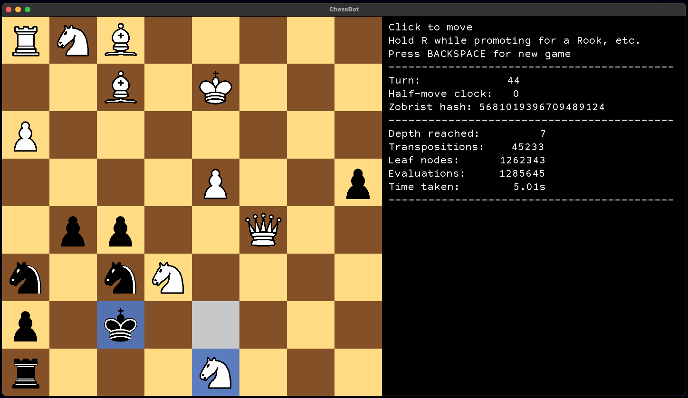

# A Chess playing program based on an optimised Negamax



## [Negamax](https://en.wikipedia.org/wiki/Negamax)
The Negamax algorithm is a simplified implementation of Minimax that takes into
account the zero-sum nature of Chess: however good a move is for you, that's how 
bad it is for your opponent and vice versa.

The bot traverses a tree, whose nodes are board-states and whose edges are moves.
The value of a player's move to that player is equivalent to how 'bad' the
resulting state of the board is for their opponent. Leaf nodes are evaluated by 
considering material advantage, and to a lesser extent development, doubled pawns and castling.
These evaluations are then propagated to each non-leaf node by negating the highest of its children's evaluations.
The logic behind this is that the players will choose the best move for them,
which will be negated for the opposition. Eventually, a value is propagated to the
root node and then the bot can select the most valuable child. However, the depth
of the tree remains to be chosen i.e. how many nodes do we look ahead before first
evaluating the goodness of a move? Choosing a single value is risky, as it may take
far too long for high depth or be highly inaccurate for low depth. 
To avoid any risk, we start at a conservative depth of 2 and increase the depth 
by 1 until we run out of time (the bot has a 5-second time limit). The time required
is exponential in the depth, so not much time is wasted in this incremental search.

In the above image, the bot has reached a depth of 7 within the time-limit, deciding
to promote to a Knight and force the King back, instead of promoting to a Queen
which is then traded with the Rook.

## [Quiescence Search](https://www.chessprogramming.org/Quiescence_Search)
One issue with the above method is that the evaluation function might miss something
that is about to happen. For example if we just promoted to a Queen, the resulting state
might look very strong, but if the Queen is instantly captured on the next move,
this would not be the case. The issue is that we evaluated an unstable node, one
where the evaluation is likely to change on subsequent moves. The solution is quiescence
search, where instead of evaluating leaf nodes, we perform an additional search of
all potential captures or promotions, to ensure we only evaluate 'quiet' nodes, where
the evaluation function is accurate.

## [Alpha Beta pruning](https://en.wikipedia.org/wiki/Alpha%E2%80%93beta_pruning) and [Transposition Tables](https://www.chessprogramming.org/Transposition_Table)
Naive Negamax is very costly: it's exponential in the search depth with a high
branching factor of ~35, producing approximately 2 billion leaf-nodes when looking
6 moves ahead. Alpha beta pruning reduces the search space by ignoring branches
that can't affect the final result. One case in which this can happen is if we have found
checkmate at some node, in which case we can ignore all sibling nodes (and therefore
their subtrees) as these must be worse.

A second optimisation uses the fact that most board states can be reached through
several sequences of moves, for example by playing the same moves in a different
order. Transposition tables use memoization to avoid re-evaluating all such boards,
further reducing the total number of evaluations. This method is particularly effective
in the endgame, where the branching factor is small due to mostly pawns being present.

## UI


The program allows for several game modes, based on which side(s) are automated.
Additionally, I've added a training mode which lets you take moves back, evaluate
potential moves and sub the bot in to make moves for you. This mode also prints
out the expected sequence of moves predicted by the Negamax traversal:


## Run the program yourself
This project uses the [LibGDX](https://libgdx.com/) game engine to render and
process user input. This allows the program to be packaged in several ways.
The smallest and easiest way to run the program is via the
[.jar file](./ChessBot.jar), which you can run with:
```
java -jar ChessBot.jar
```
or on Mac:
```
java -jar -XstartOnFirstThread ChessBot.jar
```

If you don't have Java, you can find self-contained executables on my
[Google Drive](https://drive.google.com/drive/folders/16GjyDXb7J9O-tSngmbnjE3i5C6U_TfSY?usp=sharing),
which were packaged using [packr](https://github.com/libgdx/packr).
Just download the relevant folder and run either the `.app` on Mac or
the `.exe` on Windows. You may need to change your permissions on Mac with
```
chmod +x ChessBot.app/Contents/MacOS/ChessBot
```

One more option is that you can just clone this repo and open it in Intellij.
Gradle will automatically prepare dependencies, and you can then compile and run the
program through the main method in `desktop/src/com.chessbot/DesktopLauncher.java`. If
you're on a Mac you will need to modify the run configuration to include the flag
`-XstartOnFirstThread` under VM options.
